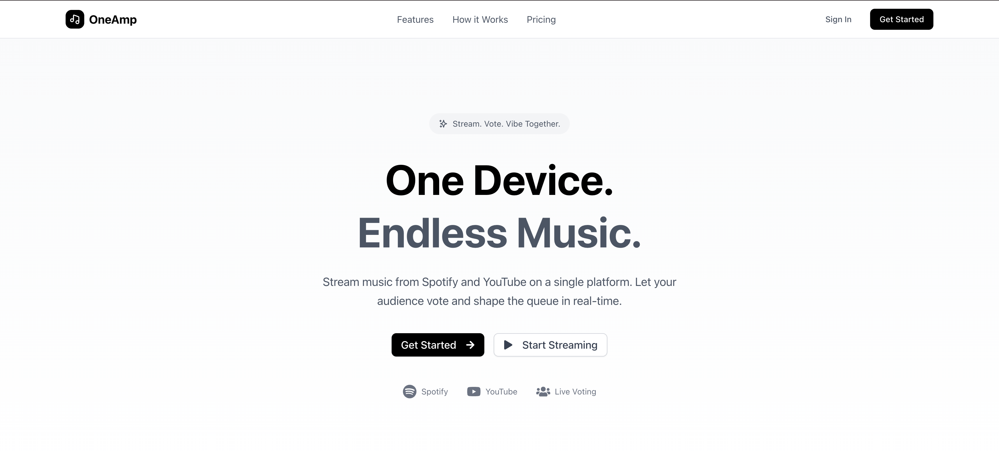

# OneAmp

[](https://oneamp.vercel.app)

<p align="center">
  
</p>

OneAmp is a collaborative music streaming platform that lets users create, join, and manage interactive music jams. Stream music from Spotify and YouTube, let your audience vote on the queue in real-time, and enjoy a seamless, multi-platform experience.

## Features

- 🎵 **Multi-Platform Music**: Add songs from Spotify and YouTube.
- 🗳️ **Live Voting**: Audience can vote and shape the queue in real-time.
- 📊 **Analytics Dashboard**: Track stream performance and engagement.
- 📱 **Mobile Optimized**: Stream and manage from any device.
- 👥 **User Profiles**: Complete your profile and connect with others.
- 🔒 **Google Authentication**: Secure sign-in with Google.
- 🖼️ **QR Code Sharing**: Share jams easily with QR codes.

## 🛠️ Tech Stack


## Getting Started

### Prerequisites

- [Node.js](https://nodejs.org/) (v18+ recommended)
- [pnpm](https://pnpm.io/) (used as the package manager)
- [PostgreSQL](https://www.postgresql.org/) or another supported database

### Installation

1. **Clone the repository:**
   ```sh
   git clone https://github.com/yourusername/oneamp.git
   cd oneamp
   ```

2. **Install dependencies:**
   ```sh
   pnpm install
   ```

3. **Configure environment variables:**
   - Create `.env` and fill in your database and OAuth credentials.

4. **Set up the database:**
   ```sh
   pnpm prisma migrate deploy
   pnpm prisma generate
   ```

5. **Run the development server:**
   ```sh
   pnpm dev
   ```
   Open [http://localhost:3000](http://localhost:3000) in your browser.

### Build for Production

```sh
pnpm build
pnpm start
```

## Project Structure

- `app/` - Next.js app directory (pages, components, API routes)
- `components/` - Shared UI components
- `prisma/` - Prisma schema and migrations
- `public/` - Static assets
- `doc/` - Documentation assets

## Scripts

- `pnpm dev` - Start development server
- `pnpm build` - Build for production (runs Prisma generate & migrate)
- `pnpm start` - Start production server
- `pnpm lint` - Run ESLint

## License

MIT

---

Made with ❤️ by mostpalon3